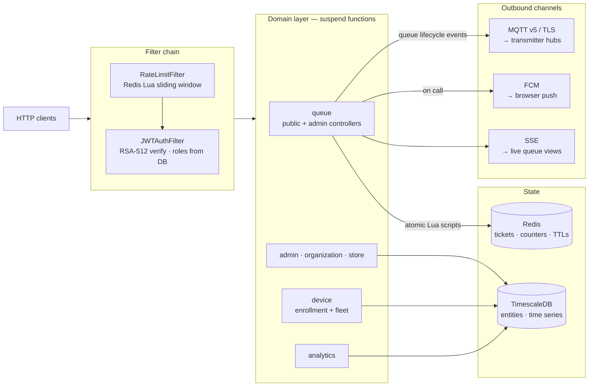

# NotiGuide — Backend

The reactive core of NotiGuide: a Kotlin/Spring Boot WebFlux API that runs virtual queues for stores. Customers join through public endpoints, staff manage the floor through authenticated ones, and every "call next" fans out to web push and physical RF pagers at once.

The stack is non-blocking end to end — Kotlin coroutines in every controller and service, R2DBC for PostgreSQL, reactive Lettuce for Redis — and the queue itself is a set of Redis Lua scripts, so ticket state changes stay atomic no matter how many counters are serving.

## Techstack

<p>
  <a href="https://kotlinlang.org/"></a>
  <a href="https://spring.io/projects/spring-boot"></a>
  <a href="https://spring.io/projects/spring-security"></a>
  <a href="https://openjdk.org/"></a>
  <a href="https://www.timescale.com/"></a>
  <a href="https://www.postgresql.org/"></a>
  <a href="https://redis.io/"></a>
  <a href="https://www.lua.org/"></a>
  <a href="https://mqtt.org/"></a>
  <a href="https://firebase.google.com/"></a>
  <a href="https://gradle.org/"></a>
  <a href="https://www.docker.com/"></a>
</p>

## The NotiGuide System

NotiGuide is an end-to-end queue management and notification system for stores — customers join a virtual queue from their phone, staff run the floor from a dashboard, and calls reach people through web push or dedicated RF pagers. This repository is the API that everything else talks to.

| Repository | Role |
|------------|------|
| [notiguide](https://github.com/Thomas-Hoang-04/notiguide) | Workspace superproject — system docs and submodule index |
| **notiguide-be** (this repo) | Reactive Kotlin/Spring Boot API — queue engine, auth, analytics, device orchestration |
| [notiguide-admin](https://github.com/Thomas-Hoang-04/notiguide-admin) | Next.js dashboard for store staff — live queue control, dispatch, analytics |
| [notiguide-client](https://github.com/Thomas-Hoang-04/notiguide-client) | Next.js customer app — join queues, track position, receive web push |
| [notiguide-transmitter](https://github.com/Thomas-Hoang-04/notiguide-transmitter) | ESP32-C3 hub bridging MQTT dispatches to RF pager calls |
| [notiguide-receiver (`esp32`)](https://github.com/Thomas-Hoang-04/notiguide-receiver/tree/esp32) | ESP32-C3 pager — dual-radio (2.4 GHz nRF24 or 433 MHz OOK) |
| [notiguide-receiver (`esp8266`)](https://github.com/Thomas-Hoang-04/notiguide-receiver/tree/esp8266) | ESP8266 pager on the 433 MHz link |

## Features

- **Redis-backed queue engine** — join, call, serve, and cancel tickets with atomic Lua scripts; per-store queues, serving sets, and daily counters, with an SSE event stream keeping the staff dashboard live.
- **Public customer endpoints** — join, track, and cancel a ticket by the store's public slug, no account needed; the customer app polls these for live position updates.
- **Role-based administration** — organizations, stores, admins, and join requests, split across `SUPER_ADMIN` and `ADMIN` roles.
- **Dual notification fan-out** — Firebase Cloud Messaging to browsers and MQTT v5 to transmitter hubs, both triggered by the same dispatch.
- **Pager fleet management** — device enrollment tokens, registration, and per-store rosters for the physical receivers.
- **Analytics** — queue KPIs aggregated on TimescaleDB and served to the admin dashboard.
- **Defense in depth** — sliding-window rate limiting, strict CORS, validated inputs, and structured error responses on every route.

## Technical Highlights

- **Atomic queue semantics in Lua.** Every ticket transition runs as a single Redis script, so concurrent counters can't double-call a ticket. TTLs drive the lifecycle (12 h waiting, 30 min called), and a keyspace-expiry listener cleans up what time forgets.
- **Reactive all the way down.** WebFlux + Kotlin coroutines, R2DBC PostgreSQL, and reactive Redis — no blocking thread pools hiding in the stack.
- **JWT without stale privileges.** RSA-512 tokens are verified with the public key only, and authorities are re-read from the database on every request, so a role change takes effect immediately.
- **Argon2 password hashing** with Spring Security's recommended parameters.
- **Rate limiting at the door.** A Redis Lua sliding-window limiter runs as the first filter in the chain, with separate strict/auth/standard tiers and `X-RateLimit-*` headers exposed through CORS.
- **Graceful degradation.** Firebase and MQTT integrations are conditional beans — the API boots and serves queues even when a notification channel is unconfigured.

## Architecture



## API Overview

The surface area at a glance — not a full reference.

| Group | Base path | Auth | Purpose |
|-------|-----------|------|---------|
| Auth | `/api/auth` | Public | Admin login and token issuance |
| Public queue | `/api/queue/public/{publicId}` | Public | Join, track, and cancel tickets |
| Admin queue | `/api/queue/admin/{storeId}` | Admin | Call next, serve, cancel, dispatch pagers |
| Stores | `/api/stores` | Admin | Store CRUD, plus `/slugs` and `/service-types` |
| Admins | `/api/admins` | Admin | Admin CRUD and `/requests` (join requests) |
| Organizations | `/api/orgs` | Admin | Organization management |
| Devices | `/api/devices` | Admin | Pager registration, plus `/enrollment-tokens` |
| Analytics | `/api/analytics` | Admin | Queue KPIs and time-series stats |

## Getting Started

You need JDK 21, Docker, and a reachable TimescaleDB (PostgreSQL 17) instance.

```bash
docker compose up -d redis   # Redis 8
./gradlew bootRun            # dev profile
./gradlew test               # unit + WebFlux slice tests
```

Connection settings come from a `.env` file (loaded via spring-dotenv): `SPRING_R2DBC_URL`, `POSTGRES_USER`, `POSTGRES_PASSWORD`, and `REDIS_PASSWORD`. Dev credentials (RSA key pair, Firebase service account) load from the classpath; production reads them from environment variables instead. Apply `src/main/resources/db/schema.sql` (and `db/analytics.sql`) to the database before first run.

## Project Structure

```
src/main/kotlin/com/thomas/notiguide/
├── core/                — cross-cutting infrastructure
│   ├── security/ jwt/   — RSA-512 JWT auth, Argon2 hashing, route rules
│   ├── redis/ ratelimit/ — queue state, TTL policy, Lua sliding-window limiter
│   ├── mqtt/ firebase/ sse/ — the three notification/live-update channels
│   ├── device/ store/   — infra halves: command signing + MQTT publishing, slug rules (domain logic lives in domain/)
│   └── tenant/ database/ config/ exception/ — invite tokens, R2DBC, app config, error handling
├── domain/              — one package per business domain
│   ├── queue/           — Lua scripts, ticket lifecycle, public + admin controllers
│   ├── admin/ organization/ store/ — accounts, orgs, stores, slugs, service types
│   ├── device/          — pager enrollment and fleet management
│   └── analytics/       — KPI aggregation
└── shared/              — principals, access helpers, client-IP resolution
```

---

_**Created by Minh Hai Hoang. June 2026**_
